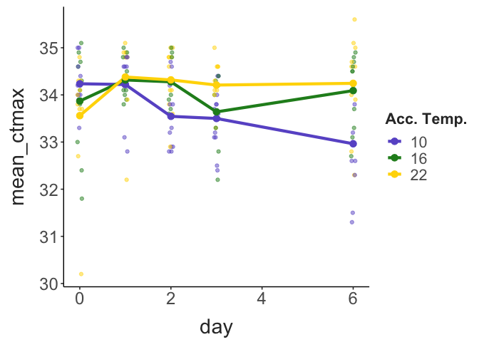
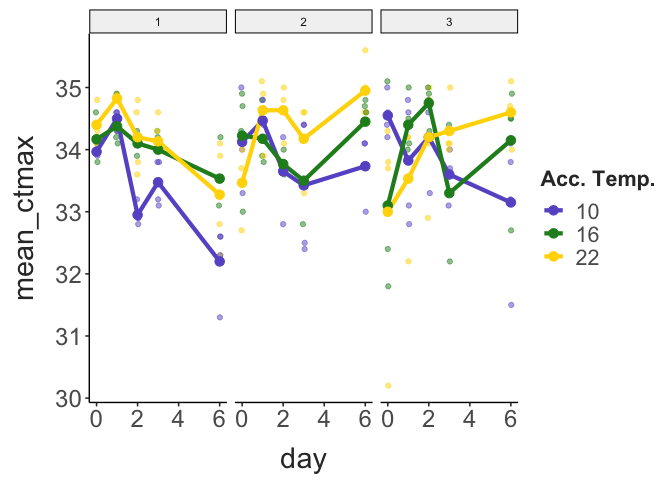
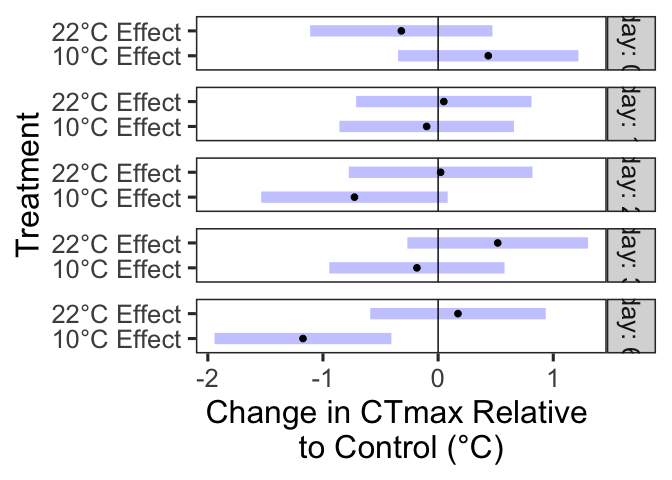
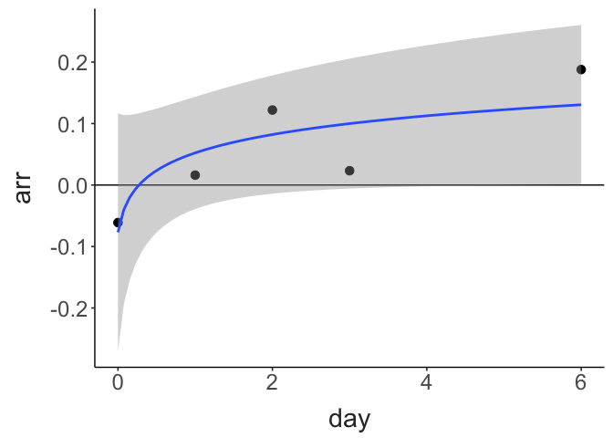
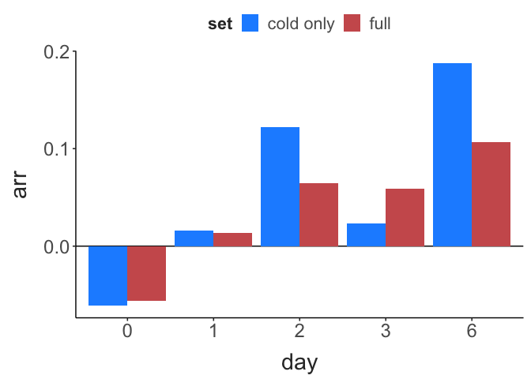

CTmax acclimation in Diacyclops navus
================
2025-08-08

- [Project Description](#project-description)
- [CTmax Measurements](#ctmax-measurements)
- [Model](#model)
- [Acclimation Response Ratios](#acclimation-response-ratios)

## Project Description

This project tests how quickly *Diacyclops navus* acclimates to
increases and decreases in temperature. Individuals were taken from a
bulk culture, maintained in lab at 16°C with a 12:12 ligh:dark cycle and
fed ad libitum *Cryptomonas ozolini*, cultured semi-continuosly in WC
medium.

During Summer 2025 we ran 3 experimental replicates. For each
experiment, groups of females (6 replicates per experiment, 15
individuals per replicate) were collected and placed into 50 mL of
dilute instant ocean (1g / L). These replicates were fed, and allowed to
acclimate to the new conditions for one day at 16°C, using a benchtop
incubator. After 1 day, CTmax was measured for randomly selected
individuals from each replicate (n = 11 individuals per day). After this
baseline CTmax measurement, replicates were divided into three groups (n
= 2 replicates per group), which were distributed to either a control
(16°C), warming (22°C), or cooling (10°C) treatments. CTmax was then
measured daily for several indviduals from all three treatments.

## CTmax Measurements

Total sample sizes (adding across experimental replicates) are shown
below.

``` r

ctmax_data %>% 
  group_by(day, acc_temp) %>% 
  count() %>% 
  pivot_wider(names_from = acc_temp, values_from = n) %>% 
  janitor::clean_names() %>% 
  select("Day" = day, "10°C" = x10, "16°C" = x16, "22°C" = x22) %>% 
  knitr::kable()
```

| Day | 10°C | 16°C | 22°C |
|----:|-----:|-----:|-----:|
|   0 |   11 |   10 |   10 |
|   1 |   10 |   12 |   11 |
|   2 |   11 |   11 |   11 |
|   3 |   12 |   10 |   11 |
|   6 |   11 |   11 |   11 |

CTmax data, again combined across all replicates is shown below, plotted
against acclimation duration.

``` r
ctmax_data %>% group_by(day, acc_temp) %>% 
  summarise(mean_ctmax = mean(ctmax, na.rm = T)) %>% 
  ungroup() %>% 
  ggplot(aes(x = day, y = mean_ctmax, colour = factor(acc_temp))) + 
  geom_point(data = ctmax_data, aes(y = ctmax), 
             alpha = 0.5, 
             position = position_jitter(width = 0.05, height = 0)) +
  geom_line(linewidth = 1.5) + 
  geom_point(size = 3) + 
  scale_colour_manual(values = c("slateblue", "forestgreen", "gold")) + 
  labs(colour = "Acc. Temp.") +
  theme_matt() + 
  theme(legend.position = "right")
```



Data here is shown for each experimental replicate separately.

``` r
ctmax_data %>% group_by(exp_rep, day, rep_id, acc_temp) %>% 
  summarise(mean_ctmax = mean(ctmax, na.rm = T)) %>% 
  ungroup() %>% 
  ggplot(aes(x = day, y = mean_ctmax, colour = factor(acc_temp), group = rep_id)) + 
  facet_wrap(exp_rep~.) + 
  geom_point(data = ctmax_data, aes(y = ctmax), 
             alpha = 0.5, 
             position = position_jitter(width = 0.05, height = 0)) +
  geom_line(linewidth = 1.5) + 
  geom_point(size = 3) + 
  scale_colour_manual(values = c("slateblue", "forestgreen", "gold")) + 
  labs(colour = "Acc. Temp.") +
  theme_matt() + 
  theme(legend.position = "right")
```



## Model

To examine the effect of acclimation over time, we fit a linear mixed
effects model to the data. CTmax was modeled as a function of day and
acclimation temperature (with interaction). The replicate, tube position
during the CTmax assay, and the experimental replicate were all included
as random effects. Model performance was checked against several sets of
assumptions.

``` r
model_data = ctmax_data %>% 
  mutate(day = factor(day), 
         acc_temp = factor(acc_temp))

acc.model = lme4::lmer(ctmax ~ day * acc_temp + (1|rep) + (1|tube) + (1|exp_rep), 
                       data = model_data)

performance::check_model(acc.model)
```

The model indicates a significant interaction between acclimation
temperature and the acclimation duration.

``` r
car::Anova(acc.model, type = "III") %>% 
  knitr::kable()
```

|              |        Chisq |  Df | Pr(\>Chisq) |
|:-------------|-------------:|----:|------------:|
| (Intercept)  | 19879.658819 |   1 |   0.0000000 |
| day          |    22.429489 |   4 |   0.0001646 |
| acc_temp     |     4.846228 |   2 |   0.0886451 |
| day:acc_temp |    25.014735 |   8 |   0.0015456 |

Marginal means for each acclimation temperature x duration combination
were extracted from this model. Contrasts were generated using a
‘treatment vs. control’ approach, where the 16°C acclimation treatment
was designated as the control. These contrasts (treatment CTmax -
control CTmax) are shown below.

``` r
emmeans::emmeans(acc.model, "acc_temp", by = "day") %>% emmeans::contrast("trt.vs.ctrlk", ref = 2) %>% 
  plot() +  
  geom_vline(xintercept = 0) + 
  labs(x = "Change in CTmax Relative \nto Control (°C)",
       y = "Treatment") + 
  #coord_flip() + 
  scale_y_discrete(labels = c("10°C Effect", "22°C Effect")) + 
  theme_bw(base_size = 24) + 
  theme(panel.grid = element_blank())
```



The acclimation effect steadily increases with time for the cold
acclimation treatment (meaning CTmax gradually decreased over time).
Warm acclimation, however, had no apparent effect on CTmax.

``` r
emmeans::emmeans(acc.model, "acc_temp", by = "day") %>% emmeans::contrast("trt.vs.ctrlk", ref = 2) %>% data.frame() %>% 
  mutate(contrast = if_else(contrast == "acc_temp10 - acc_temp16", "Cold Acc.", "Hot Acc."),
         day = as.numeric(as.character(day))) %>% 
  ggplot(aes(x = day, y = estimate, colour = contrast)) + 
  geom_hline(yintercept = 0) +
  geom_point(size = 3) + 
  geom_smooth(method = "lm", linewidth = 2) + 
  scale_colour_manual(values = c("Cold Acc." = "dodgerblue", 
                                 "Hot Acc." = "indianred")) + 
  labs(x = "Acclimation Duration",
       y = "Acclimation Effect (°C)") + 
  theme_matt() + 
  theme(legend.position = "right")
```


## Acclimation Response Ratios

Examining the relationship between CTmax and acclimation temperature is
traditionally how acclimation is measured. The magnitude of acclimation
is often standardized against the difference in acclimation
temperatures, yielding Acclimation Response Ratios (ARRs; the °C change
in thermal limits per °C change in acclimation temperature).

The relationship between CTmax and acclimation temperature is shown
here, broken down by day. A loess smoother is included in each panel to
show the relationship between CTmax and acclimation temperature.
Notably, reaction norms are relatively flat on Day 1, begin to take on a
linear trend in Days 2 and 3, but by Day 6 there is a distinct
non-linear trend.

``` r

ctmax_data %>% 
  filter(ctmax > 31) %>% 
  # filter(day != 0) %>% 
  # group_by(exp_rep, day, acc_temp) %>% 
  # summarise(mean_ctmax = mean(ctmax, na.rm = T)) %>% 
  # ungroup() %>% 
  # mutate(acc_temp = as.numeric(as.character(acc_temp)),
  #        day = as.numeric(as.character(day))) %>% 
  ggplot(aes(x = acc_temp, y = ctmax)) + 
  facet_wrap(day~.) + 
  geom_point(size = 3, position = position_jitter(width = 0.3, height = 0),
             alpha = 0.5) + 
  geom_smooth(se = F, colour = "black", linewidth = 2) + 
  scale_x_continuous(breaks = c(10, 16, 22)) + 
  theme_matt() + 
  theme(legend.position = "right")
```


As a consequence of these changes, the ARR changed over time, as shown
below.

``` r

daily_arr = ctmax_data %>% 
  split(ctmax_data$day) %>% 
  map(\(df) lm(ctmax ~ acc_temp, data = df)) %>% 
  map(coef) %>% 
  map_dbl("acc_temp") %>% 
  data.frame() %>% 
  rownames_to_column(var = "day") %>% 
  janitor::clean_names() %>% 
  select(day, "arr" = x) %>% 
  mutate(day = as.numeric(as.character(day))) 


ggplot(daily_arr, aes(x = day, y = arr)) + 
  geom_hline(yintercept = 0) + 
  geom_point(size = 3) + 
  geom_smooth(method = "lm", formula = y~log(x + 0.06)) + 
  theme_matt()
```


The same analysis was performed with just the cold acclimation and
control treatments.

``` r

subset_daily_arr = ctmax_data %>% 
  filter(acc_temp != 22) %>% 
  split(filter(ctmax_data, acc_temp != 22)$day) %>% 
  map(\(df) lm(ctmax ~ acc_temp, data = df)) %>% 
  map(coef) %>% 
  map_dbl("acc_temp") %>% 
  data.frame() %>% 
  rownames_to_column(var = "day") %>% 
  janitor::clean_names() %>% 
  select(day, "arr" = x) %>% 
  mutate(day = as.numeric(as.character(day))) 

ggplot(subset_daily_arr, aes(x = day, y = arr)) + 
  geom_hline(yintercept = 0) + 
  geom_point(size = 3) + 
  geom_smooth(method = "lm", formula = y~log(x + 0.06)) + 
  theme_matt()
```



The pattern in ARR is similar until Day 6, when the ‘cold only’ subset
results in a substantially larger ARR than the entire data set.

``` r

bind_rows(mutate(daily_arr, "set" = "full"), 
          mutate(subset_daily_arr, "set" = "cold only")) %>% 
  mutate(day = factor(day)) %>% 
  ggplot(aes(x = day, y = arr, fill = set)) + 
  geom_hline(yintercept = 0) + 
  geom_bar(stat = "identity", position = position_dodge(width = 0.9)) + 
  scale_fill_manual(values = c("dodgerblue", "indianred")) + 
  theme_matt()
```


